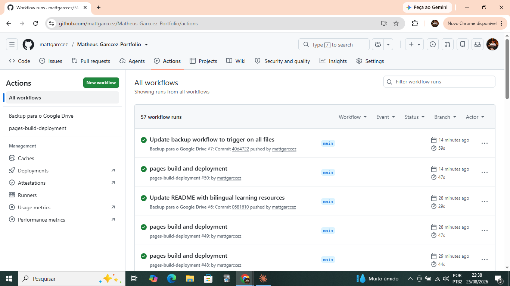
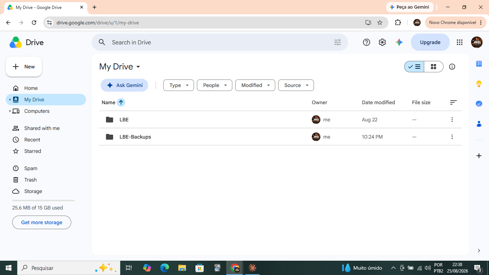
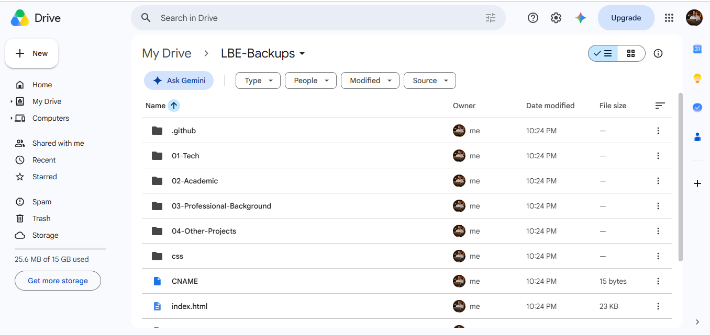

# Project: Automated GitHub → Google Drive Backup

🇺🇸 [English](#english) · 🇧🇷 [Português](#português)

---

<a name="english"></a>

## 🇺🇸 English

### Overview

An automated pipeline that backs up this repository to Google Drive every time changes are pushed to the `main` branch, using GitHub Actions and `rclone`, with no manual steps required after setup.

### Problem

I needed a reliable way to back up my portfolio repository to Google Drive automatically, without depending on remembering to do it manually (e.g. downloading a ZIP and re-uploading it every time something changed).

### Diagnosis

My first approach was to use a **Google Service Account** (a machine identity) with a JSON key, authorized via GitHub Secrets, to let GitHub Actions write directly to a Google Drive folder.

This looked correct on paper (the folder was shared with the service account with Editor permissions, the Drive API was enabled), but every run failed with:

```
Error 404: File not found
```

specifically when the automation tried to **create subfolders** inside the target directory, even though uploading a file directly succeeded.

After investigating, the root cause turned out to be a well-documented Google limitation: **Service Accounts cannot reliably create files/folders on a personal ("My Drive") Google account.** This effectively requires a Google Workspace (paid, business) account with Shared Drives — not available on a standard `@gmail.com` account.

### Solution

I switched the authentication strategy from a Service Account to **OAuth authentication using my own personal Google account**, via `rclone`:

1. Created a custom OAuth Client ID (Desktop app type) in Google Cloud Console, since rclone's shared client ID is being phased out by Google in 2026
2. Authorized `rclone` locally, once, by logging in with my personal Google account through the browser
3. Took the resulting `rclone.conf` (containing the OAuth token) and stored it as an encrypted GitHub Secret (`RCLONE_CONFIG`)
4. Updated the GitHub Actions workflow to write that secret into `rclone`'s config at runtime, then run `rclone copy` to sync the repository into a `LBE-Backups` folder on Google Drive

Along the way, I hit a secondary issue: passing the OAuth token (which itself contains embedded JSON with double quotes) into a shell command wrapped in double quotes caused the string to terminate early, corrupting the config file. Fixed by wrapping the secret in single quotes instead.

### Result

Every push to `main` now automatically triggers a GitHub Actions workflow that:
- Installs `rclone` on a fresh runner
- Authenticates using the stored OAuth credentials
- Copies the entire repository (excluding `.git/`) into `Google Drive → LBE-Backups`

No manual step is needed after a normal `git push`.

**Evidence:**

| Workflow running successfully | Backup folder created on Drive | Full repository content synced |
|---|---|---|
|  |  |  |

### Future considerations

- **Token expiration**: OAuth refresh tokens can be revoked or expire under certain conditions (e.g. if unused for a long period, or if account security settings change). If the automation starts failing with an authentication error, the fix is to re-run `rclone config` locally and update the `RCLONE_CONFIG` secret.
- **Repository growth**: as the repository grows, backup time will increase. If it becomes slow, incremental sync flags or excluding large binary files may be worth revisiting.
- **Multiple repositories**: the same pattern (OAuth + `rclone` + GitHub Actions) can be reused for other repositories by generating a new `RCLONE_CONFIG` secret per project, or reusing the same one across repos if they should back up to the same Drive account.
- **Credential hygiene**: during setup, a service account key and an OAuth token were briefly exposed (visible on screen / pasted in a chat) and were immediately revoked and regenerated. This reinforced the importance of never treating credentials as disposable, even in a learning/testing context.

### Tools & concepts involved

`GitHub Actions` · `rclone` · `Google Cloud Console` · `OAuth 2.0` · `Google Drive API` · `Service Accounts` (and their limitations) · Secrets management · CI/CD basics

> Built with guidance from Claude (Anthropic) as a pair-programming and learning tool throughout the diagnosis and implementation process.

---

<a name="português"></a>

## 🇧🇷 Português

### Projeto: Automação de Backup GitHub → Google Drive

### Visão geral

Um pipeline automatizado que faz backup deste repositório para o Google Drive toda vez que há um push na branch `main`, usando GitHub Actions e `rclone`, sem necessidade de nenhuma etapa manual depois da configuração inicial.

### Problema

Eu precisava de uma forma confiável de fazer backup do meu repositório de portfólio para o Google Drive automaticamente, sem depender de lembrar de fazer isso manualmente (por exemplo, baixando um ZIP e subindo de novo toda vez que algo mudasse).

### Diagnóstico

Minha primeira abordagem foi usar uma **Service Account** do Google (uma identidade de máquina) com uma chave JSON, autorizada via Secrets do GitHub, para deixar o GitHub Actions escrever diretamente numa pasta do Google Drive.

Isso parecia correto na teoria (a pasta estava compartilhada com a service account com permissão de Editor, a API do Drive estava ativada), mas toda execução falhava com:

```
Error 404: File not found
```

especificamente quando a automação tentava **criar subpastas** dentro do diretório de destino, mesmo o upload direto de um arquivo funcionando.

Depois de investigar, a causa raiz se mostrou uma limitação bem documentada do Google: **Service Accounts não conseguem criar arquivos/pastas de forma confiável numa conta pessoal do Google Drive ("Meu Drive").** Esse recurso, na prática, exige uma conta Google Workspace (paga, empresarial) com Drives Compartilhados — o que não está disponível numa conta `@gmail.com` comum.

### Solução

Troquei a estratégia de autenticação de Service Account para **autenticação OAuth usando minha própria conta pessoal do Google**, via `rclone`:

1. Criei um Client ID OAuth próprio (tipo Aplicativo para Computador) no Google Cloud Console, já que o client ID compartilhado do rclone está sendo descontinuado pelo Google em 2026
2. Autorizei o `rclone` localmente, uma única vez, logando com minha conta pessoal do Google pelo navegador
3. Peguei o `rclone.conf` resultante (contendo o token OAuth) e guardei como um Secret criptografado no GitHub (`RCLONE_CONFIG`)
4. Atualizei o workflow do GitHub Actions para escrever esse secret na configuração do `rclone` em tempo de execução, e então rodar `rclone copy` pra sincronizar o repositório numa pasta `LBE-Backups` no Google Drive

No caminho, encontrei um problema secundário: passar o token OAuth (que contém um JSON interno com aspas duplas) dentro de um comando shell delimitado por aspas duplas fazia a string terminar antes da hora, corrompendo o arquivo de configuração. Corrigido trocando para aspas simples ao redor do secret.

### Resultado

Todo push na `main` agora dispara automaticamente um workflow do GitHub Actions que:
- Instala o `rclone` numa máquina limpa
- Autentica usando as credenciais OAuth armazenadas
- Copia o repositório inteiro (exceto `.git/`) para `Google Drive → LBE-Backups`

Nenhuma etapa manual é necessária depois de um `git push` normal.

**Evidências:**

| Workflow rodando com sucesso | Pasta de backup criada no Drive | Conteúdo completo do repositório sincronizado |
|---|---|---|
|  |  |  |

### Considerações futuras

- **Expiração do token**: tokens de atualização OAuth podem ser revogados ou expirar em certas condições (ex: se ficarem muito tempo sem uso, ou se configurações de segurança da conta mudarem). Se a automação começar a falhar com erro de autenticação, a correção é rodar `rclone config` localmente de novo e atualizar o secret `RCLONE_CONFIG`.
- **Crescimento do repositório**: à medida que o repositório crescer, o tempo de backup vai aumentar. Se ficar lento, vale revisitar flags de sincronização incremental ou excluir arquivos binários grandes.
- **Múltiplos repositórios**: o mesmo padrão (OAuth + `rclone` + GitHub Actions) pode ser reaproveitado para outros repositórios, gerando um novo secret `RCLONE_CONFIG` por projeto, ou reutilizando o mesmo entre repositórios que devam ir para a mesma conta do Drive.
- **Higiene de credenciais**: durante a configuração, uma chave de service account e um token OAuth ficaram brevemente expostos (visíveis em tela / colados num chat) e foram imediatamente revogados e regenerados. Isso reforçou a importância de nunca tratar credenciais como descartáveis, mesmo em contexto de aprendizado/teste.

### Ferramentas e conceitos envolvidos

`GitHub Actions` · `rclone` · `Google Cloud Console` · `OAuth 2.0` · `Google Drive API` · `Service Accounts` (e suas limitações) · Gestão de secrets · Fundamentos de CI/CD

> Desenvolvido com apoio do Claude (Anthropic) como ferramenta de aprendizado e pair-programming ao longo do processo de diagnóstico e implementação.
